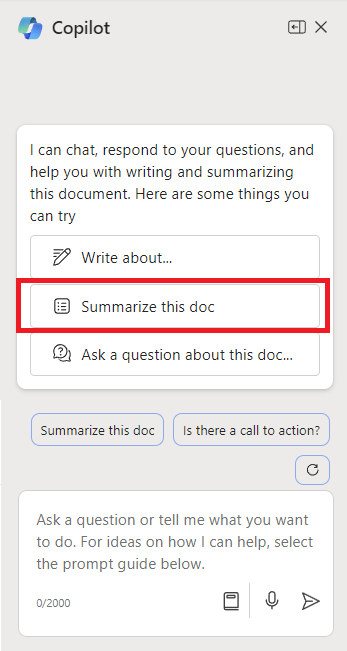

Para começar a usar o Microsoft 365 Copilot no Word, você pode abrir o painel do **Copilot** selecionando o ícone do Copilot na guia **Página Inicial** da faixa de opções. 

Esse recurso útil fornece respostas a perguntas — amplas ou específicas — sobre seu documento. Tenha uma discussão para iterar e refinar seus resultados, obter um resumo ou informações específicas sobre o conteúdo do documento ou solicitar que ele gere ideias, tabelas ou listas que você pode copiar e inserir em seu documento.

No exemplo a seguir, transformamos um prompt básico para o Copilot no Word em um prompt contextual bem construído que fornece exatamente o que você precisa, da maneira que você precisa.

## Vamos começar a criar

Primeiro, baixe **_[Market Analysis Report for Mystic Spice Premium Chai Tea.docx](https://go.microsoft.com/fwlink/?linkid=2268826)_** e salve o arquivo na **pasta do OneDrive**, caso ainda não o tenha feito.

Abra o documento no Word e, em seguida, abra o painel do **Copilot** selecionando o ícone do Copilot na guia **Página Inicial** da faixa de opções. Insira os prompts abaixo e acompanhe.

> [!NOTE]
> Prompt inicial:
>
> _Resuma esse documento do Word._

Neste prompt simples, você começa com o **objetivo** básico: _resumir um documento do Word._ No entanto, não há informações sobre por que o documento precisa ser resumido ou para que o resumo é necessário.

| Element | Exemplo |
| :------ | :------- |
| Prompt básico:  Comece com um **objetivo** | **Resuma esse documento do Word.** |
| Prompt bom:  Adicione **contexto** | Adicionar **contexto** pode ajudar o Copilot a entender o propósito do resumo e adaptar a resposta de acordo.  "_com uma breve visão geral dos principais pontos a serem discutidos com a minha equipe durante a reunião de vendas de amanhã._" |
| Prompt melhor:  Especificar **fonte(s)** | Adicionar **fontes** pode ajudar o Copilot a entender qual documento ou parte precisa ser resumido e fornecer uma resposta mais precisa.  "_...a seção de Análise Competitiva..._" |
| O melhor prompt:  Defina **expectativas claras** | Por fim, adicionar **Expectativas** pode ajudar o Copilot a entender como formatar o resumo e qual nível de detalhe é necessário.  "_Mantenha o resumo em 5 pontos-chave e use uma linguagem simples._" |

> [!NOTE]
> **Prompt criado**:
>
> _Resuma a seção sobre Análise Competitiva neste documento do Word com uma breve visão geral dos principais pontos a serem discutidos com minha equipe durante a reunião de vendas de amanhã. Mantenha o resumo em 5 pontos-chave e use uma linguagem simples._

Este prompt tem todos os detalhes necessários, **Objetivo**, **Contexto**, **Fonte** e **Expectativas**, para que o Copilot possa lhe dar a resposta que você está procurando. 

## Explore mais

Experimente o prompt final que criamos, mas usando seu próprio documento do Word. Personalize o **Contexto**, as **Fontes** e as **Expectativas** para obter o que precisa do documento, sem nada extra que você não precisa.

Quais são outras maneiras para adicionar contexto, fontes ou expectativas ao seu prompt? Você consegue pensar em outras estratégias de criação de prompts que poderia usar para gerar a resposta desejada?

> [!IMPORTANT]
> Esse recurso está disponível para clientes com uma licença do Copilot para Microsoft 365 ou do Copilot Pro. Para obter mais informações, consulte [Bem-vindo ao Copilot no Word](https://support.microsoft.com/en-us/office/welcome-to-copilot-in-word-2135e85f-a467-463b-b2f0-c51a46d625d1).

Na próxima unidade, veremos como criar prompts semelhantes para o Copilot no PowerPoint.