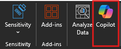

# Identifique tendências e visualize dados com o Copilot no Excel

O Microsoft 365 Copilot no Excel ajuda você a fazer mais com seus dados em tabelas do Excel, gerando sugestões de colunas de fórmulas, mostrando insights em gráficos e Tabelas Dinâmicas e destacando partes interessantes de dados.

No Excel, selecione **Copilot** na faixa de opções para abrir o painel de chat.

Para usar o Copilot no Excel, seus dados precisarão ser formatados de uma das seguintes maneiras:

- Como uma tabela do Excel
- Como um intervalo de suporte

Você pode criar uma tabela ou converter um intervalo de células em uma tabela se tiver um intervalo de dados seguindo estas etapas:

1. Selecione a célula ou o intervalo nos dados.

1. Selecione **Página Inicial > Formatar como Tabela**.

1. Na caixa de diálogo  **Formatar como Tabela** , marque a caixa de seleção ao lado de  **Minha tabela tem cabeçalhos**  se você quiser que a primeira linha do intervalo seja a linha de cabeçalho.

1. Selecione  **OK**.

Se você preferir manter seus dados em um intervalo e não convertê-los em uma tabela, eles precisarão atender a todos os seguintes requisitos:

- Apenas uma linha de cabeçalho
- Os cabeçalhos estão apenas em colunas, não em linhas
- Os cabeçalhos são exclusivos; sem cabeçalhos duplicados
- Sem cabeçalhos em branco
- Os dados são formatados de forma consistente
- Sem subtotais
- Sem linhas ou colunas vazias
- Sem células mescladas

No exemplo a seguir, começamos com uma solicitação básica para analisar uma tabela e progressivamente adicionar elementos para tornar o prompt mais robusto.

## Vamos começar a criar

Primeiro, baixe **_[Contoso Chai Tea market trends 2023.xlsx](https://go.microsoft.com/fwlink/?linkid=2268822)_** e salve o arquivo na **pasta do OneDrive**, caso ainda não o tenha feito isso.

Abra a planilha no Excel e, em seguida, abra o painel do **Copilot** selecionando o ícone Copilot na guia **Página Inicial** da faixa de opções. Insira os prompts abaixo e acompanhe.

> [!NOTE]
> Prompt inicial:
>
> _Analise esta tabela no Excel._

Neste prompt simples, você começa com o **objetivo** básico: _analisar uma tabela do Excel._ No entanto, não há informações sobre por que a tabela precisa ser resumida ou para que o resumo é necessário.

| Elemento | Exemplo |
| :------ | :------- |
| **Prompt básico:** comece com uma **meta** | **Analise esta tabela no Excel.** |
| **Prompt razoável:** adicione **contexto** | Adicionar **contexto** pode ajudar o Copilot a entender o objetivo da análise e ajustar a resposta de acordo. _"Estamos procurando os produtos mais vendidos de maio a agosto para vendas de chai artesanal ou vendas de chai pronto para beber."_ |
| **Prompt ainda melhor:** especifique as **fontes** | Adicionar **fontes** pode ajudar o Copilot a restringir o escopo, dizendo-lhe para usar informações ou intervalos específicos. _"... de maio a agosto para vendas de chai artesanal ou vendas de chai pronto para beber..."_ |
| **O prompt ideal:** defina **expectativas** claras | Por fim, adicionar **Expectativas** pode ajudar o Copilot a entender como formatar o resumo e qual nível de detalhe é necessário. _"Resuma o produto mais vendido para cada mês."_ |

> [!NOTE]
> **Prompt criado**:
>
> _Analise esta tabela no Excel. Estamos procurando os produtos mais vendidos de maio a agosto para vendas de chai artesanal ou vendas de chai pré-fabricadas. Resuma o produto mais vendido para cada mês._

Esse prompt fornece ao Copilot tudo o que ele precisa para encontrar uma boa resposta, incluindo o **Objetivo**, o **Contexto**, a **Fonte** e as **Expectativas**.

## Explorar mais

Experimente o prompt final criado e outros com sua própria tabela do Excel. Aqui estão algumas sugestões para outros prompts que você pode querer experimentar. Copie-os e adicione **Contexto**, **Fontes** e **Expectativas**.  

- Plote as vendas por categoria ao longo do tempo.

- Mostre o total de vendas de cada produto.

- Mostre o total de vendas de publicidade para cada região no ano passado.

> [!IMPORTANT]
> Esse recurso está disponível para clientes com uma licença do Microsoft 365 Copilot ou do Copilot Pro. Para saber mais sobre tabelas do Excel e como criá-las, consulte [Criar uma tabela no Excel](https://support.microsoft.com/office/bf0ce08b-d012-42ec-8ecf-a2259c9faf3f).
