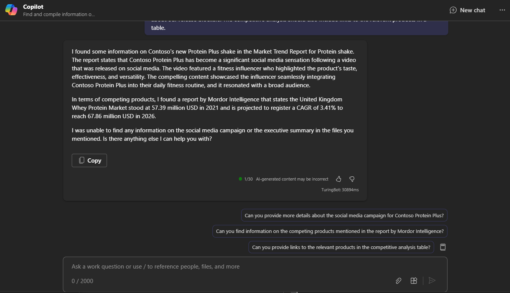

# Resumir informações sobre um tópico com o Microsoft 365 Copilot Chat

O Microsoft 365 Copilot Chat (Copilot Chat) combina o poder da IA (inteligência artificial) com seus dados de trabalho e aplicativos para ajudar você a liberar a criatividade, desbloquear a produtividade e aprimorar as habilidades. Ele funciona em vários aplicativos e conteúdo, oferecendo o poder da IA junto com seus dados de trabalho seguros. Sua capacidade de sintetizar informações e criar coisas a partir de várias fontes ao mesmo tempo permite que você atinja metas e objetivos mais amplos.

Para comparar, o Copilot nos diferentes aplicativos do Microsoft 365 (como Word ou PowerPoint) é especificamente orquestrado para ajudar você **dentro de um só aplicativo**. Por exemplo, o Copilot no Word foi projetado para ajudar você a redigir, editar e consumir conteúdo melhor. No PowerPoint, ele serve para ajudar você a criar apresentações melhores. Mas com o Copilot Chat, podemos reunir tudo isso em uma nova experiência.

Você pode acessar o Copilot Chat de várias maneiras:

- Use o Copilot Chat nas versões desktop e móvel do Microsoft Teams. Consulte [Usar o Copilot Chat no Teams](https://support.microsoft.com/topic/open-microsoft-365-chat-in-teams-c6de0a62-4f9e-479d-b5f2-af036e342181).

- Acesse o Copilot Chat em Microsoft365.com/copilot. Consulte [Usar o Copilot Chat em Microsoft.com/Copilot](https://support.microsoft.com/topic/use-microsoft-365-chat-at-microsoft365-com-or-in-the-microsoft-365-office-app-4a2538f9-962f-4c7c-a368-f6006bc13d6f).

## Vamos começar a criar

Primeiro, baixe e salve os seguintes arquivos na **pasta do OneDrive** e adicione-os à sua lista de MRU:

- [Contoso Chai Tea market trends 2023.xlsx](https://go.microsoft.com/fwlink/?linkid=2268822)

- [Contoso Chai Tea market trends 2023.docx](https://go.microsoft.com/fwlink/?linkid=2269122)

- [Market Trend Report- Protein shake.docx](https://go.microsoft.com/fwlink/?linkid=2268827)

Abra o Copilot Chat no Microsoft Teams e acompanhe os prompts que fazem referência aos arquivos acima.

> [!NOTE]
> Prompt inicial:
>
> _Encontre e compile informações sobre o novo shake Protein Plus da Contoso._

Neste prompt simples, você começa com o **objetivo** básico: _resumir informações sobre um novo produto._ No entanto, não há informações sobre por que você precisa do resumo ou o que está procurando.

| Elemento | Exemplo |
| :------ | :------- |
| **Prompt básico:** comece com uma **meta** | **Encontre e compile informações sobre o novo shake Protein Plus da Contoso.** |
| **Prompt razoável:** adicione **contexto** | Adicionar **contexto** pode ajudar o Copilot a entender o propósito e ajustar a resposta de acordo. _"...para uma revisão trimestral de negócios. Precisamos de um resumo executivo, bem como detalhes sobre a campanha de mídia social e produtos concorrentes."_ |
| **Prompt ainda melhor:** especifique as **fontes** | Adicionar **fontes** pode ajudar o Copilot a entender onde procurar informações e fornecer uma resposta mais precisa. _"Procure informações em **/Market Analysis Report for Mystic Spice Premium Chai Tea.docx**, **/Contoso Chai Tea market trends 2023.xlsx** e **/Market Trend Report - Protein shake.docx** para escrever o resumo executivo"._ |
| **O prompt ideal:** defina **expectativas** claras | Por fim, adicionar **Expectativas** pode ajudar o Copilot a entender como formatar o resumo e qual nível de detalhe é necessário. _"O resumo deve soar profissional, com um tom esperançoso sobre nossos bloqueadores de lançamento. A análise competitiva também deve incluir links para os produtos relevantes em uma tabela."_ |

> [!NOTE]
> **Prompt criado**:
>
> _Encontre e compile informações sobre o novo shake Protein Plus da Contoso para uma próxima revisão trimestral de negócios. Precisamos de um resumo executivo, bem como detalhes sobre a campanha em redes sociais e produtos concorrentes. Procure informações em **/Market Analysis Report for Mystic Spice Premium Chai Tea.docx**,  **/Contoso Chai Tea market trends 2023.xlsx**, e  **/Market Trend Report - Protein shake.docx** para escrever o resumo executivo. O resumo deve soar profissional, com um tom esperançoso sobre nossos bloqueadores de lançamento. A análise competitiva também deve incluir links para os produtos relevantes em uma tabela._

Com o **objetivo**, o **contexto**, a **fonte** e as **expectativas** definidos, o Copilot tem tudo o que precisa para lhe dar uma ótima resposta.

## Explorar mais

Você também pode usar o Copilot para obter resumos e acompanhar as coisas rapidamente. Ele pode reunir resumos rápidos de projetos, reuniões, mensagens de email, chat e muito mais. Use-o para descobrir o que é necessário fazer, obter as atualizações mais recentes de um projeto ou encontrar rapidamente as comunicações recentes de um colega ou gerente.

Veja mais alguns exemplos:

- _Na semana passada, alguém compartilhou um documento que definia as principais datas de entrega do Projeto X. Quais foram essas datas_?

- _Resuma as mensagens de Sam nas últimas duas semanas. Destaque todos os detalhes importantes, como entregas, datas de vencimento e itens de ação para mim_.

- _Liste os desenvolvimentos no Produto Z que seriam relevantes para um executivo proprietário do lançamento do produto, com base na colaboração nos últimos cinco dias úteis_.
