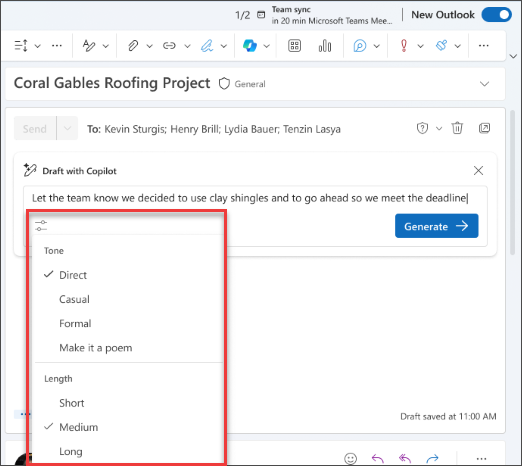

# Elaborar emails, respostas e agendas de reuniões com o Microsoft 365 Copilot no Outlook

O Copilot no Outlook facilita o gerenciamento da caixa de entrada com assistência da plataforma AI para ajudar você a escrever emails rapidamente e transformar longas conversas de email em resumos curtos. Isso combina o poder dos LLMs (modelos de linguagem grande) com dados do Outlook para ajudar você a se manter produtivo no local de trabalho. Ele pode resumir tópicos de email (também conhecidos como conversas), extraindo pontos-chave de várias mensagens.

> [!NOTE]
> A criação de rascunho no Outlook para Microsoft 365 está atualmente disponível no novo Outlook para Windows, Outlook na Web e Outlook.com. Se você tiver o Outlook clássico, [obtenha o novo Outlook](https://support.microsoft.com/office/start-using-new-outlook-for-windows-4395454d-cb2f-4c16-bb24-fa4bb36650ae). Se você não conseguir acessar, verifique com seu administrador de TI.

O Copilot no Outlook pode ajudar você a redigir rapidamente um email ou uma resposta a uma conversa existente.

1. No Outlook, selecione **Página Inicial > Novo Email > Email**.

1. Para iniciar uma nova mensagem, selecione o **ícone do Copilot** na barra de ferramentas.

1. Selecione **Rascunho com Copilot** no menu suspenso.

    

1. Na caixa do Copilot, **digite seu prompt**.

1. Selecione **Gerar opções** para escolher o comprimento e o tom desejados.

    

1. Quando terminar, selecione **Gerar**. O Copilot elabora uma mensagem para você.

1. Analise a mensagem. Se não for bem o que você deseja, escolha **Regenerar rascunho**, e o Copilot criará uma nova versão.

1. Para recomeçar, altere o prompt e selecione **Gerar** novamente.

1. Quando estiver satisfeito com o resultado, selecione **Manter**.

1. Edite o rascunho conforme necessário e selecione **Enviar**.

    

## Vamos começar a criar

> [!NOTE]
> Prompt inicial:
>
> _Crie um rascunho de um novo email._

Neste prompt simples, você começa com o **objetivo** básico: _criar o rascunho de um novo email._ No entanto, não há informações sobre o que será o email, para quem enviá-lo ou como você deseja que ele soe.

| Elemento | Exemplo |
| :------ | :------- |
| **Prompt básico:** comece com uma **meta** | **_Crie o rascunho de um novo email._** |
| **Prompt razoável:** adicione **contexto** | Adicionar **contexto** pode ajudar o Copilot a entender sobre o que o email deve ser e quem é o público. _"...ao meu cliente, Allan Deyoung, sobre o status de seu tíquete de suporte."_ |
| **Prompt ainda melhor:** especifique as **fontes** | Adicionar **fontes** pode ajudar o Copilot a saber onde procurar informações específicas. _"Consulte a atualização mais recente das minhas anotações: o problema foi encaminhado para o suporte de nível 2 e uma resolução é esperada dentro de 48 horas."_ |
| **O prompt ideal:** defina **expectativas** claras | Por fim, adicionar **expectativas** pode ajudar o Copilot a entender como você deseja que o documento seja escrito e formatado. _"O email deve soar profissional e técnico, mas escrito com empatia."_ |

> [!NOTE]
> **Prompt criado**:
>
> _Elabore um novo email para meu cliente, Allan Deyoung, sobre o status de seu tíquete de suporte. Consulte a atualização mais recente das minhas anotações: O problema foi encaminhado para o suporte de Nível 2 e uma resolução é esperada dentro de 48 horas. O e-mail deve soar profissional e técnico, mas escrito com empatia._

Neste prompt, o Copilot tem todas as informações necessárias para lhe dar uma resposta sólida, graças ao **Objetivo**, **Contexto**, **Fonte** e **Expectativas** neste prompt.

> [!IMPORTANT]
> O Copilot no Outlook só dá suporte a contas corporativas ou de estudante e contas da Microsoft que usam endereços de email outlook.com, hotmail.com, live.com e msn.com no momento. Qualquer conta Microsoft usando uma conta de um provedor de email de terceiros como o Gmail, Yahoo ou iCloud ainda pode usar o Outlook, mas não terá acesso aos recursos do Copilot no Outlook. Para mais informações, consulte [Criar um rascunho de uma mensagem de email com o Copilot no Outlook](https://support.microsoft.com/office/draft-an-email-message-with-copilot-in-outlook-3eb1d053-89b8-491c-8a6e-746015238d9b).
