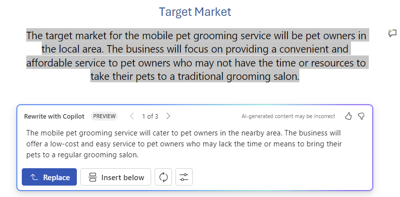

# Escrever, organizar e transformar conteúdo usando o Microsoft 365 Copilot no Word

O Microsoft 365 Copilot no Word permite que você permaneça no fluxo de ideias enquanto elabora novos conteúdos e transforma seu conteúdo depois de ter suas ideias escritas. O Copilot pode reescrever seu texto, incluindo ajustes de tom. O Copilot também pode transformar seu texto em uma tabela editável. Siga as etapas para transformar seu conteúdo no Word:

## Reescrever para tom

1. Selecione o texto que você deseja reescrever com o Copilot.

1. Na margem esquerda ao lado do texto, selecione o ícone do **Copilot**.

1. No menu do Copilot da margem esquerda, selecione **Reescrever**.

1. O Copilot mostra opções reescritas para você escolher.

1. Selecione **Substituir** para usar o texto revisado, **Inserir abaixo** para inserir o texto reescrito abaixo do texto atual, **Regenerar** para regenerar as sugestões do Copilot ou **Ajustar tom** para ajustar o texto reescrito para o tom desejado.

    

## Texto para tabela

1. Selecione o texto que você quer que o Copilot transforme em uma tabela.

1. Na margem esquerda ao lado do texto, selecione o ícone do **Copilot**.

1. No menu do Copilot da margem esquerda, selecione **Visualizar como uma tabela**.

1. O Copilot mostra como é a tabela.

1. Selecione **Manter** para inserir a tabela no documento, **Regenerar** para regenerar a tabela do Copilot ou **Descartar** para remover a tabela.

1. Para ajustar a tabela, insira detalhes na caixa de composição do Copilot para indicar o que alterar na tabela.

    1. Não há suporte para alterar a formatação de uma tabela usando a caixa de composição, mas a formatação da tabela pode ser alterada usando as opções de tabela na faixa de opções do Word.

    

No exemplo a seguir, começamos com um prompt simples para transformar algum texto em uma tabela e adicionar elementos ao longo do caminho. Acompanhe o exemplo usando seus próprios dados.

## Vamos começar a criar

Primeiro, baixe **_[Graphic Design Institute - Employee Benefits.docx](https://go.microsoft.com/fwlink/?linkid=2268825)_** e salve o arquivo na **pasta do OneDrive**, caso ainda não o tenha feito.

Abra o documento no Word e realce todo o texto no documento (pressione **Ctrl+A**). No menu do Copilot da margem esquerda, selecione **Visualizar como uma tabela**. Depois de gerar a tabela, continue com o Copilot usando as instruções abaixo para refinar seus resultados.

> [!NOTE]
> Prompt inicial:
>
> _Visualize como uma tabela._

Neste prompt simples, você começa com o **objetivo** básico: _transformar o texto em uma tabela._ No entanto, não há indicação de quais informações você deseja na tabela ou por que ela deve ser uma tabela.

| Elemento | Exemplo |
| :------ | :------- |
| **Prompt básico:** comece com uma **meta** | **_Visualize como uma tabela._** |
| **Prompt razoável:** adicione **contexto** | Adicionar **contexto** pode ajudar o Copilot a entender que tipo de dados ver e para que serão usados. _"Precisamos de uma maneira clara de comunicar esses benefícios aos funcionários em potencial."_ |
| **Prompt ainda melhor:** especifique as **fontes** | A **fonte** neste exemplo é o texto completo de **Graphic Design Institute - Employee Benefits.docx**. |
| **O prompt ideal:** defina **expectativas** claras | Por fim, adicionar **Expectativas** pode ajudar o Copilot a entender como você deseja que a tabela seja organizada e escrita. _"Inclua uma terceira coluna que descreva claramente o benefício para o funcionário e como isso afeta seu bem-estar."_ |

> [!NOTE]
> **Prompt criado**:
>
> _Visualize como uma tabela. Precisamos de uma maneira clara de comunicar esses benefícios aos funcionários em potencial. Inclua uma terceira coluna que descreva claramente o benefício para o funcionário e como isso afeta seu bem-estar._

Esse prompt fornece ao Copilot tudo o que ele precisa para encontrar uma boa resposta, incluindo o **Objetivo**, o **Contexto**, a **Fonte** e as **Expectativas**.

> [!IMPORTANT]
> Esse recurso está disponível para clientes com uma licença do Microsoft 365 Copilot ou do Copilot Pro. Para obter mais informações, consulte [Transformar seu conteúdo com o Copilot no Word](https://support.microsoft.com/office/transform-your-content-with-copilot-in-word-923d9763-f896-4da7-8a3f-5b12c3bfc475).
