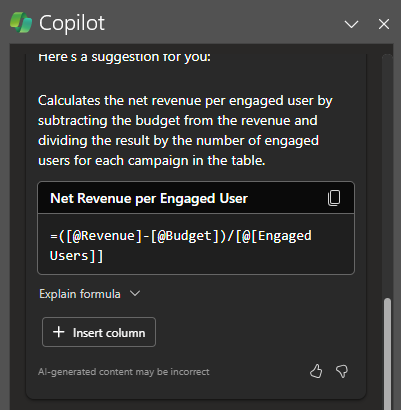

Com o Microsoft 365 Copilot no Excel, é fácil destacar, classificar e filtrar suas tabelas para direcionar a atenção rapidamente para o que é importante para você. Usando uma única tabela no Excel, você pode ter o Copilot sem esforço: 

- Classifique e filtre os dados.

- Aplique formatação condicional simples.

Para começar, formate seus dados como uma tabela e selecione o ícone do **Copilot** na faixa de opções. Em seguida, diga ao Copilot como você gostaria de manipular a tabela para visualizar melhor partes de seus dados. 

No exemplo a seguir, começaremos com um prompt simples e adicionaremos elementos ao longo do caminho. Acompanhe o exemplo usando seus próprios dados.

## Vamos começar a criar

Primeiro, baixe **_[Faibrikam Q1 marketing campaigns.xlsx](https://go.microsoft.com/fwlink/?linkid=2269124)_** e salve o arquivo na **pasta do OneDrive**, caso ainda não tenha feito isso.

Abra a planilha no Excel e, em seguida, abra o painel do **Copilot** selecionando o ícone Copilot na guia **Página Inicial** da faixa de opções. Insira os prompts abaixo e acompanhe.

> [!NOTE]
> Prompt inicial:
>
> _Classifique esta tabela._

Neste prompt simples, você começa com o **objetivo** básico: _classificar e filtrar uma tabela do Excel._ No entanto, não há indicação de como você deseja que os dados sejam classificados e qual campo deseja filtrar.

| Element | Exemplo |
| :------ | :------- |
| Prompt básico:  Comece com um **objetivo** | **_Classifique esta tabela..._** |
| Prompt bom:  Adicione **contexto** | Adicionar **contexto** pode ajudar o Copilot a entender para que servem os slides e em qual tópico focar.  "_...para procurar o vendedor mais impactante._" |
| Prompt melhor:  Especificar **fonte(s)** | Supõe-se que a **Fonte** desse prompt seja a tabela com a qual estamos trabalhando no Excel.  "_... esta tabela [Table1]_…” |
| O melhor prompt:  Defina **expectativas claras** | Por fim, adicionar **Expectativas** pode ajudar o Copilot a entender como você deseja que a tabela seja classificada, filtrada e apresentada.  "_Adicione uma terceira coluna que calcula a receita líquida por usuário engajado, levando em consideração seus custos orçamentários. Classifique esta tabela em ordem decrescente pela receita líquida por usuário engajado e destaque o melhor e o pior proprietários._" |

> [!NOTE]
> **Prompt criado**:
>
> _Classifique esta tabela [Tabela 1] para procurar o vendedor mais impactante. Adicione uma terceira coluna que calcule a receita líquida por usuário engajado, levando em consideração seus custos orçamentários. Classifique essa tabela em ordem decrescente pela receita líquida por usuário engajado e destaque o melhor e o pior proprietários._

Esse prompt requer várias etapas para executar uma técnica de prompt chamada **encadeamento**, onde você pede ao Copilot para executar comandos sequenciais e consecutivos para atingir um único objetivo. 

No prompt criado, o Copilot entende que primeiro precisa criar uma fórmula para a nova coluna para calcular a receita líquida por usuário engajado e inseri-la na tabela.

Agora que a nova coluna foi inserida na tabela, você pode pedir ao Copilot que classifique a tabela pela maior receita líquida por usuário engajado, bem como destacar os vendedores superiores e inferiores.

O Copilot tem todas as informações necessárias para lhe dar uma resposta sólida, graças a ter **Objetivo**, **Contexto**, **Fonte** e **Expectativas** neste prompt.

## Explore mais

Experimente estes prompts simples para destacar, classificar e filtrar seus dados e adicionar outros elementos para melhorar seus resultados:

- Marque em negrito os 10 principais valores na coluna Vendas.

- Destaque os maiores valores em Unidades Vendidas.

- Classifique a taxa de participação da menor para a maior.  

- Filtre para itens que vencem na próxima semana.

> [!IMPORTANT]
> O Copilot só funcionará em arquivos armazenados no OneDrive ou no SharePoint. Se você não conseguir selecionar o botão do Copilot na faixa de opções, tente salvar o arquivo na nuvem primeiro. Para mais informações, consulte **[Destaque, classifique e filtre seus dados com o Copilot no Excel](https://support.microsoft.com/office/highlight-sort-and-filter-your-data-with-copilot-in-excel-05302e3f-de42-4475-b235-be9cb3d4e936)**.