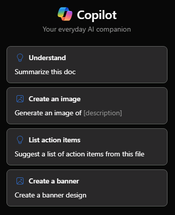

# Peça ajuda e recomendações ao Microsoft 365 Copilot no Word

Para começar a usar o Copilot no PowerPoint, você pode abrir o painel **Copilot** selecionando o ícone do Copilot na guia **Página Inicial** da faixa de opções.

Além de criar conteúdo ou gerar ideias, o Copilot no Word tem a capacidade de responder a perguntas sobre o documento que você está lendo. Depois que o Copilot responder ao seu prompt, você também poderá visualizar referências com citações de onde o Copilot extraiu informações em seu documento.

## Faça perguntas sobre este documento

- Resumir este documento – Precisa chegar à essência do documento rapidamente? Digite Resuma este documento no painel de chat do Copilot para obter um resumo com marcadores do documento.

- Há uma chamada para a ação? – Quer saber se o documento contém uma chamada à ação significativa? Pergunte ao Copilot, e ele tentará lhe dizer.

## Faça perguntas abertas

Deseja adicionar algum conteúdo ou contexto ao seu documento? Faça perguntas gerais ao Copilot e ele tentará lhe dar respostas. Por exemplo:

- Como posso editar este documento para torná-lo mais acadêmico?

- Há alguma citação de um presidente dos Estados Unidos sobre coragem?

Se essas respostas não estiverem no documento, o Copilot gerará conteúdo usando os modelos de linguagem grande subjacentes. Se você encontrar algo que goste e quiser adicioná-lo ao documento, basta copiar e colar do painel do Copilot para o documento.

## Vamos começar a criar

Primeiro, baixe **_[Market Analysis Report for Mystic Spice Premium Chai Tea.docx](https://go.microsoft.com/fwlink/?linkid=2268826)_** e salve o arquivo na **pasta do OneDrive**, caso ainda não o tenha feito.

Abra o documento no Word e, em seguida, abra o painel do **Copilot** selecionando o ícone do Copilot na guia **Página Inicial** da faixa de opções. Insira os prompts abaixo e acompanhe.

> [!NOTE]
> Prompt inicial:
>
> _Há uma chamada para a ação?_

Neste prompt simples, você começa com o **objetivo** básico: _encontrar uma chamada à ação significativa no documento._ No entanto, você ainda não explicou _por que_ precisa dessas informações.

| Elemento | Exemplo |
| :------ | :------- |
| **Prompt básico:** comece com uma **meta** | **_Há uma chamada para a ação?_** |
| **Prompt razoável:** especifique as **fontes** | Adicionar **fontes** pode ajudar o Copilot a procurar informações específicas. _"...neste relatório de análise de mercado..."_ |
| **Prompt ainda melhor:** Adicione o **contexto** | Adicionar **contexto** pode ajudar o Copilot a responder com contexto e fornecer uma resposta mais personalizada. _"...para abordar nossos desafios e preocupações. Verifique se o plano de marketing inclui um plano de ação claro e específico, como um plano promocional ou um desconto por tempo limitado."_ |
| **O prompt ideal:** defina **expectativas** claras | Por fim, adicionar **expectativas** pode ajudar o Copilot a entender exatamente o que você precisa, em vez de apenas dar uma resposta _sim_ou _não_. _"Forneça sugestões para melhorar a chamada para ação, se necessário."_ |

> [!NOTE]
> **Prompt criado**:
>
> _Existe uma chamada para a ação neste relatório de análise de mercado para abordar nossos desafios e preocupações? Verifique se o plano de marketing inclui um plano de ação claro e específico, como um plano promocional ou um desconto por tempo limitado. Forneça sugestões para melhorar a chamada à ação, se necessário._

Esse prompt fornece ao Copilot tudo o que ele precisa para encontrar uma boa resposta, incluindo o **Objetivo**, o **Contexto**, a **Fonte** e as **Expectativas**.

> [!IMPORTANT]
> Esse recurso está disponível para clientes com uma licença do Microsoft 365 Copilot ou do Copilot Pro. Para obter mais informações, consulte [Conversar com o Copilot sobre seu documento do Word](https://support.microsoft.com/office/chat-with-copilot-about-your-word-document-4482c688-a495-4571-bfcd-4a9fc6608090).
