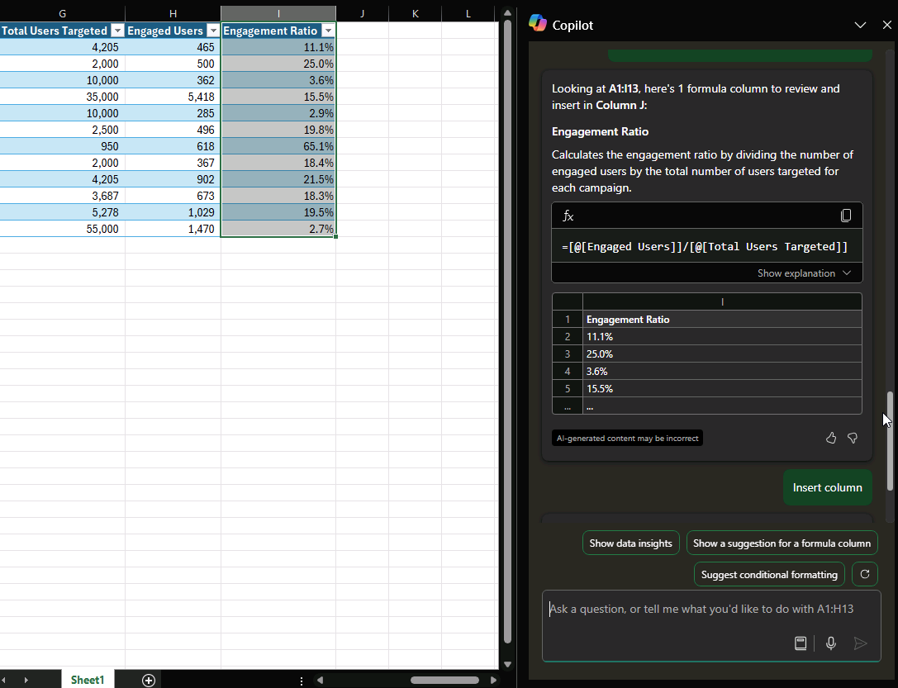

# Analisar e trabalhar com tabelas usando o Microsoft 365 Copilot no Excel

Se você não tiver certeza de como escrever uma fórmula para uma nova coluna, o Microsoft 365 Copilot poderá adicionar rapidamente novas colunas com fórmulas baseadas em seus dados.

1. Com os dados formatados como uma tabela, selecione o botão do **Copilot** na faixa de opções.

1. Selecione **Adicionar colunas de fórmula** ou **Mostrar sugestões para colunas de fórmula**. Você também pode descrever quais colunas deseja adicionar digitando-as em suas próprias palavras.

1. O Copilot fornece sugestões de fórmulas com uma explicação sobre como cada fórmula funciona. Exiba a explicação selecionando **Explicar fórmula**.

1. Selecione Inserir coluna para adicionar a coluna de fórmula à tabela.

> [!IMPORTANT]
> Como acontece com qualquer conteúdo gerado por IA, é importante revisar, editar e verificar tudo o que o Copilot cria para você.

## Vamos começar a criar

Primeiro, baixe **_[Faibrikam Q1 marketing campaigns.xlsx](https://go.microsoft.com/fwlink/?linkid=2269124)_** e salve o arquivo na **pasta do OneDrive**, caso ainda não tenha feito isso.

Abra a planilha no Excel e, em seguida, abra o painel do **Copilot** selecionando o ícone Copilot na guia **Página Inicial** da faixa de opções. Insira os prompts abaixo e acompanhe.

> [!NOTE]
> Prompt inicial:
>
> _Sugira uma coluna de fórmula._

Neste prompt simples, você começa com a **meta** básica: _criar uma nova coluna com uma fórmula._ No entanto, não há detalhes suficientes para determinar o que a fórmula deve calcular.  

| Elemento | Exemplo |
| :------ | :------- |
| **Prompt básico:** comece com uma **meta** | **_Sugira uma coluna de fórmula._** |
| **Prompt razoável:** adicione **contexto** | Adicionar **contexto** ajuda o Copilot a entender o que a fórmula deve calcular. _"... para a coluna J a fim de determinar a taxa de engajamento de cada campanha."_ |
| **Prompt ainda melhor:** especifique as **fontes** | A **Origem** desse prompt são as colunas específicas necessárias para o cálculo. _"... usando os valores de 'Usuários engajados' e "Total de usuários direcionados'."_ |
| **O prompt ideal:** defina **expectativas** claras | Adicionar **expectativas** ajuda o Copilot a estruturar a fórmula corretamente. _"Certifique-se de que a fórmula divida 'Usuários engajados' por 'Total de usuários direcionados' e formate o resultado como uma porcentagem."_ |

> [!NOTE]  
> **Prompt criado**:  
>
> _Sugira uma fórmula para a coluna J a fim de calcular a taxa de engajamento de cada campanha. Use os valores de "Usuários engajados" e "Total de usuários segmentados". Certifique-se de que a fórmula divida "Usuários engajados" por "Total de usuários direcionados" e formate o resultado como uma porcentagem._  

O Copilot tem todas as informações necessárias para lhe dar uma resposta sólida, graças a ter **Objetivo**, **Contexto**, **Fonte** e **Expectativas** neste prompt.

## Explorar mais

Use esses prompts como ponto de partida. Copie-os e modifique-os para atender às suas necessidades.

- Calcule o custo total por produto em uma nova coluna.

- Adicione uma coluna que calcule o lucro total de cada campanha de marketing em 2022.

- Adicione uma coluna que calcule o número de dias após o evento de lançamento do produto.

Para obter mais informações, consulte [Gerar colunas de fórmula com o Copilot no Excel](https://support.microsoft.com/office/generate-formula-columns-with-copilot-in-excel-d866d926-9791-4e5f-be2a-c6dd9e587a47).
