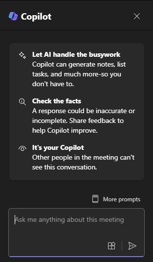

O Microsoft 365 Copilot em reuniões e chamadas do Teams ajuda você a capturar itens de ação, diferentes perspectivas por tópico ou perguntas não resolvidas. Você pode até pedir ao Copilot para lhe dar uma resposta como uma tabela, gerando uma tabela de markdown pronta para você copiar e compartilhar. 

O Copilot no Teams usa o conteúdo do chat e da reunião do Teams para gerar insights e sugestões acionáveis junto com seus pontos de contato mais importantes do Teams. O Copilot no Teams é contextual para o que quer que você esteja fazendo. Por exemplo, você pode acessar o painel do Copilot em um chat, uma reunião ou uma chamada, desde que algumas condições sejam atendidas:

- A transcrição ou gravação está ativada. O organizador da reunião pode configurar a reunião para que o Copilot trabalhe sem transcrição antes da reunião.

- A reunião ou chamada é longa o suficiente para o Copilot analisar. Se ainda não houver discurso transcrito suficiente na reunião, o Copilot afirma que precisa de mais informações antes de responder aos prompts.

## Acessar o Copilot durante uma reunião

1. Durante uma reunião ou chamada, selecione **Copilot** nos controles da reunião. Se a transcrição ainda não estiver ativada, você será solicitado a ativá-la. 

    

1. O Copilot é aberto no lado direito da janela da reunião. Quando a reunião terminar, selecione a reunião no **Calendário do Teams**. A partir daí, selecione a guia **Recapitulação** nos detalhes da reunião. Você também pode acessar o painel do Copilot na recapitulação da reunião para fazer perguntas sobre a reunião.

    

## Comece simples e adicione detalhes

> [!NOTE]
> Prompt inicial:
>
> _Que questões não estão resolvidas nesta reunião?_

Neste prompt simples, você começa com o **objetivo** básico: _identificar quaisquer questões em aberto que não foram resolvidas durante a reunião_. No entanto, não há muitas informações sobre a solicitação ou reunião.

| Element | Exemplo |
| :------ | :------- |
| Prompt básico:  Comece com um **objetivo** | **Que questões não estão resolvidas nesta reunião?** |
| Prompt bom:  Adicione **contexto** | Adicionar **contexto** pode ajudar o Copilot a entender o propósito e ajustar a resposta de acordo.  "_...na reunião com o cliente sobre a proposta do novo projeto._" |
| Prompt melhor:  Especificar **fonte(s)** | Adicionar **fontes** pode ajudar o Copilot a entender qual reunião ou parte da reunião precisa ser pesquisada, mas, nesse caso, a **fonte** já está presumida.  "_na reunião com o cliente_?" |
| O melhor prompt:  Defina **expectativas claras** | Por fim, adicionar **expectativas** pode ajudar o Copilot a entender o que fazer com as informações encontradas.  "_Identifique quaisquer perguntas ou preocupações que foram levantadas, mas não abordadas na última reunião. Forneça sugestões para abordar essas questões e preocupações na próxima reunião._ |

> [!NOTE]
> **Prompt criado**:
>
> _Quais questões permanecem sem solução na reunião com o cliente em relação à nova proposta de projeto. Identifique quaisquer perguntas ou preocupações que foram levantadas, mas não abordadas na última reunião. Forneça sugestões para abordar essas questões e preocupações na próxima reunião._

Neste prompt, o **Objetivo**, o **Contexto**, a **Fonte** e as **Expectativas** são fornecidos, dando ao Copilot direção suficiente para gerar uma resposta que atenda às suas necessidades.

## Explore mais

Ao abrir o **Copilot no Teams** pela primeira vez, você recebe algumas dicas para usar o Copilot e prompts sugeridos para começar. Ao processar as transcrições da reunião e do chat, ele gera respostas a solicitações como: 

- Que questões não estão resolvidas nesta reunião? 

- Que opiniões os membros da equipe tinham sobre esta campanha? 

- Criar uma tabela de prós e contras para esta campanha. 

Para obter mais cenários sobre como usar o Copilot em reuniões do Teams, consulte [Introdução ao Copilot em reuniões do Microsoft Teams](https://support.microsoft.com/office/get-started-with-copilot-in-microsoft-teams-meetings-0bf9dd3c-96f7-44e2-8bb8-790bedf066b1). 